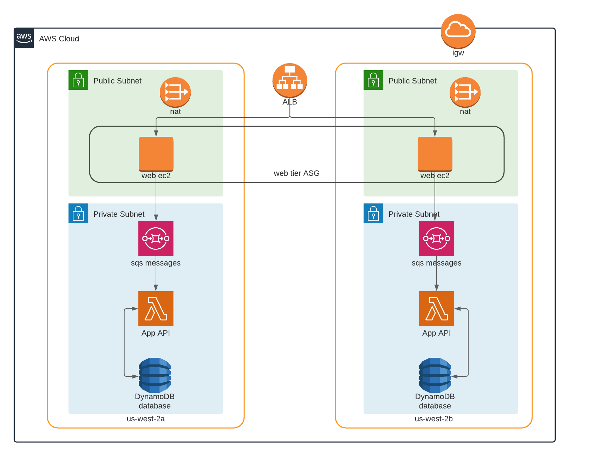

# AWS Web Application -- Personal Website with NoSQL Database

This repo is for the 3-tier web application deployed on AWS. The application Web tier contains the Front-End code for my personal website, the App Tier is an API lambda function to access database, and the Database tier contains Back-End DynamoDB database.

## 1. Design Overview

The Web Tier contains two EC2 instances on different AZs, which will run the nodejs job at the server. Every time the Front-Tier get request from user side, it will send SQS messages to AWS.

The Application Tier lambda function will get request messages from SQS, and trigger the lambda function to write data into database.

The Database Tier is an on-demand DynamoDB table will hold all the user request data from web API.

The following shows the Design diagram for the 3 tier web application: 

